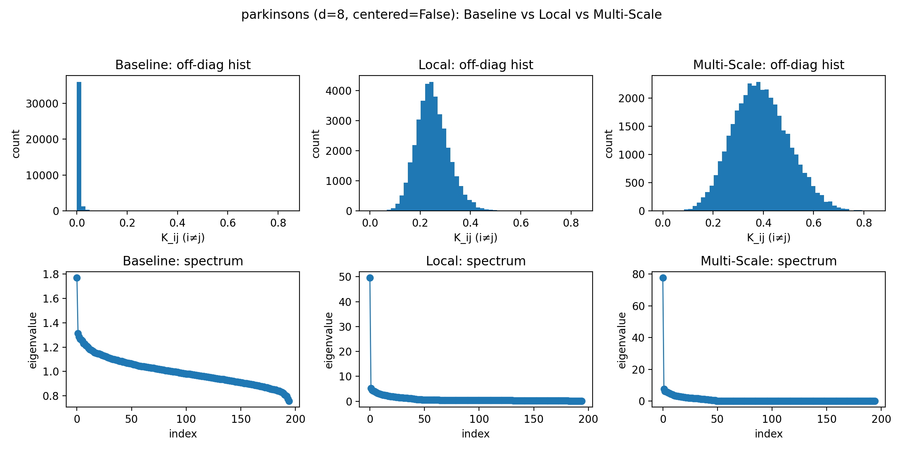
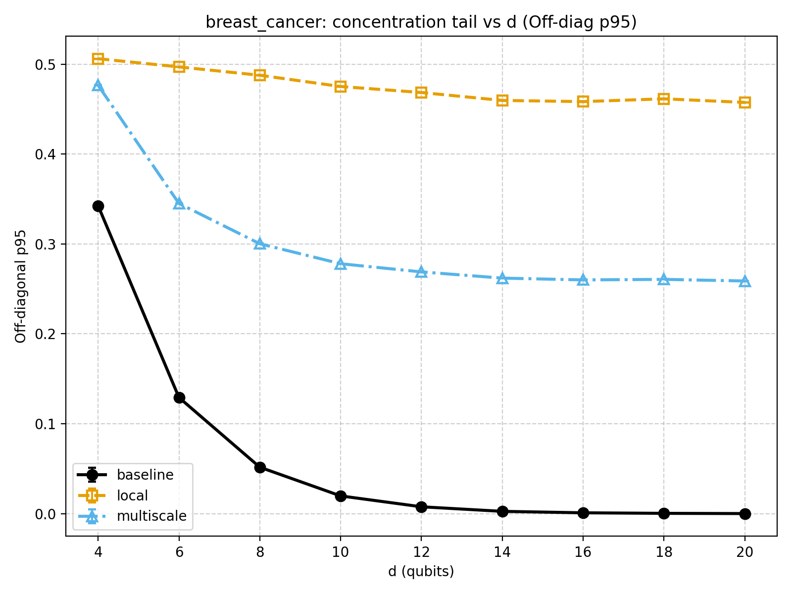
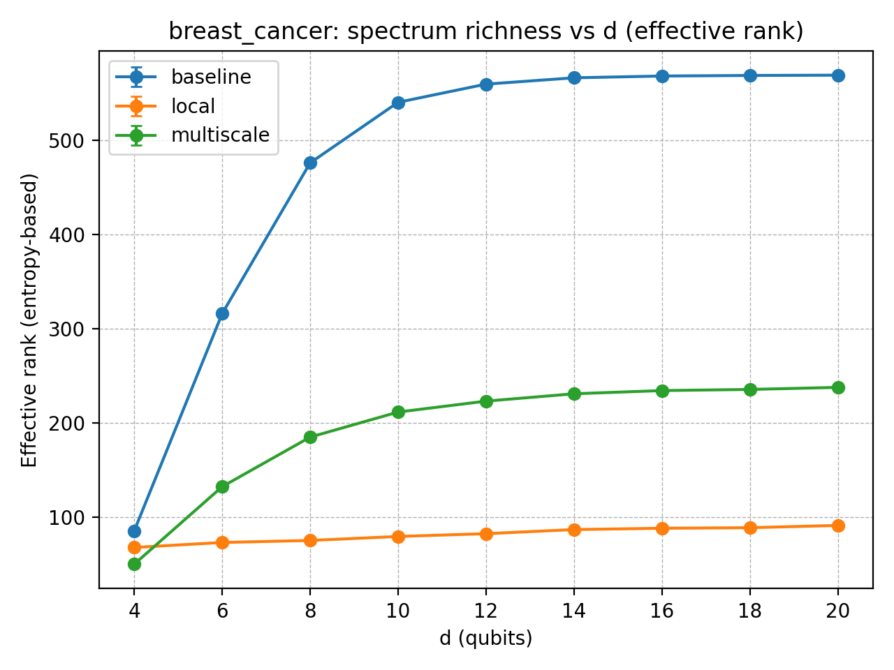
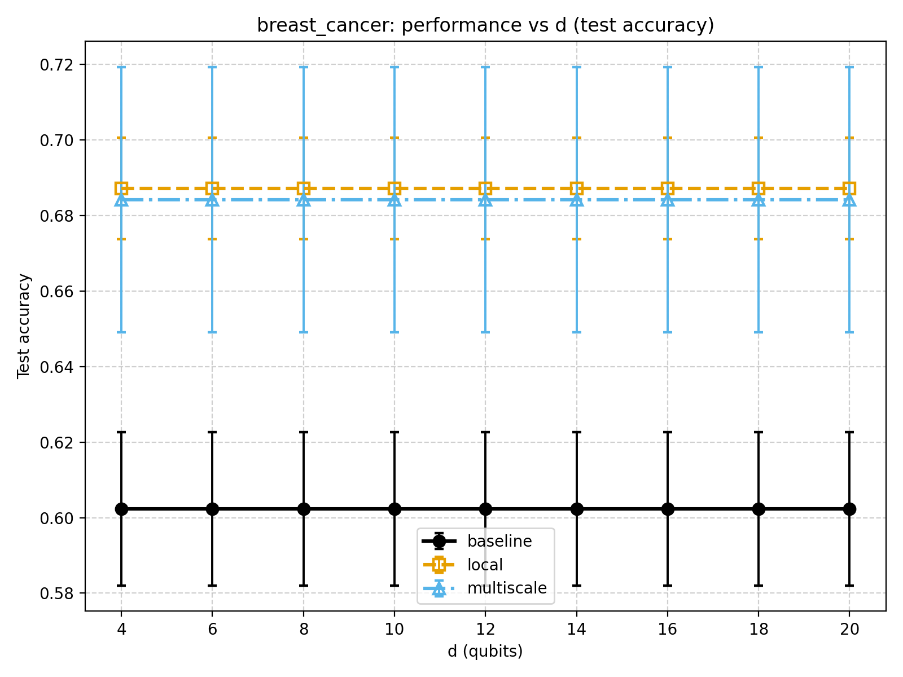
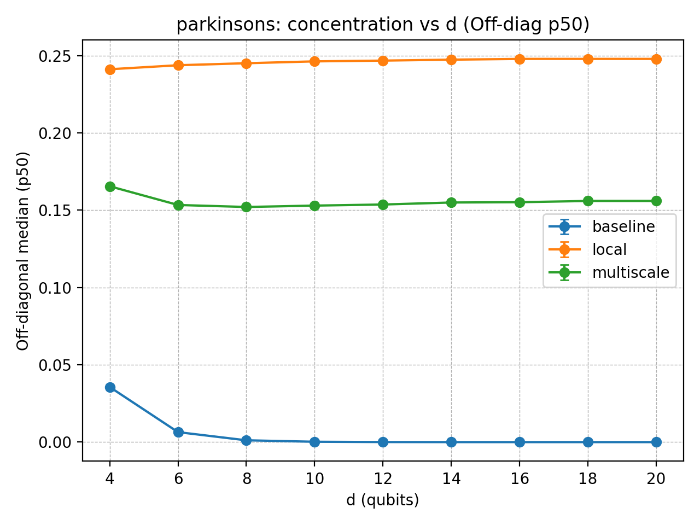
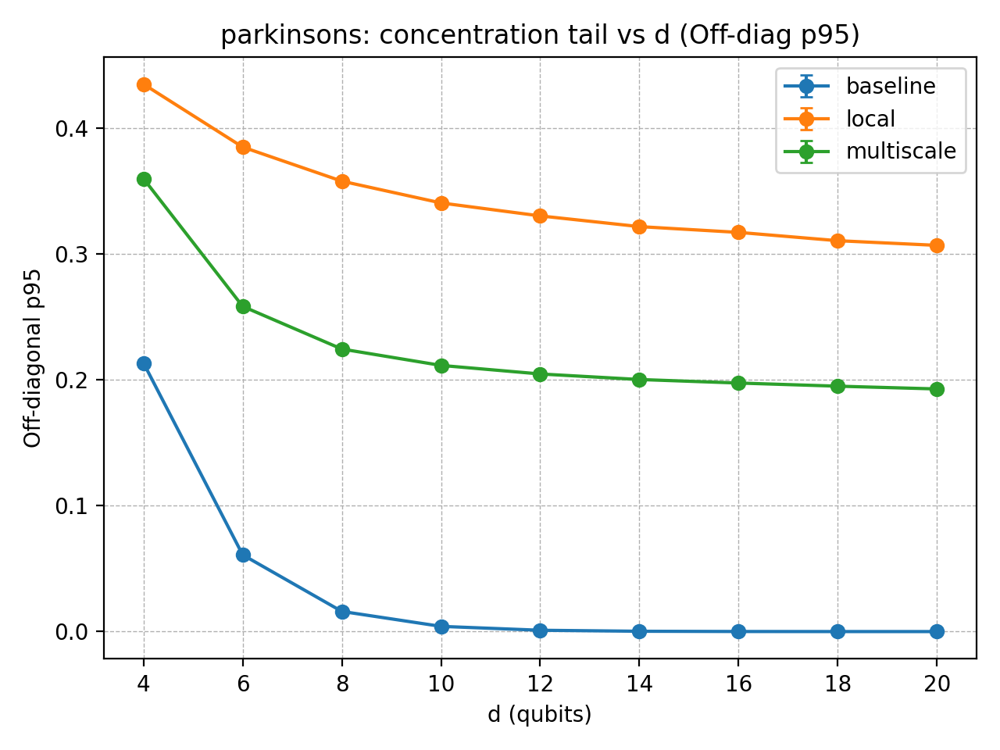
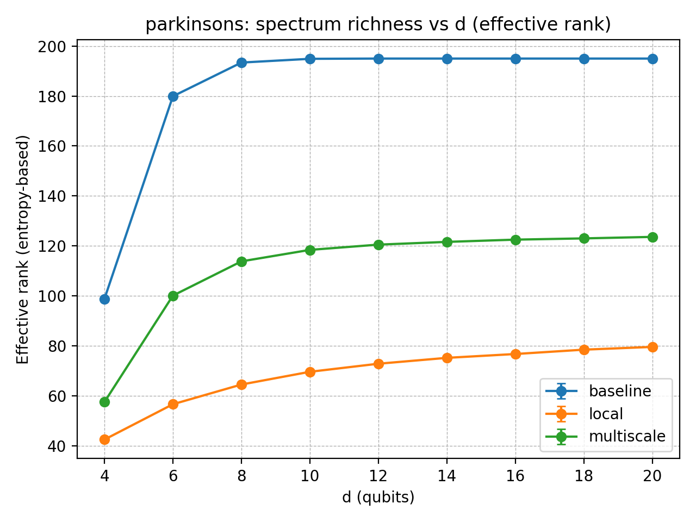
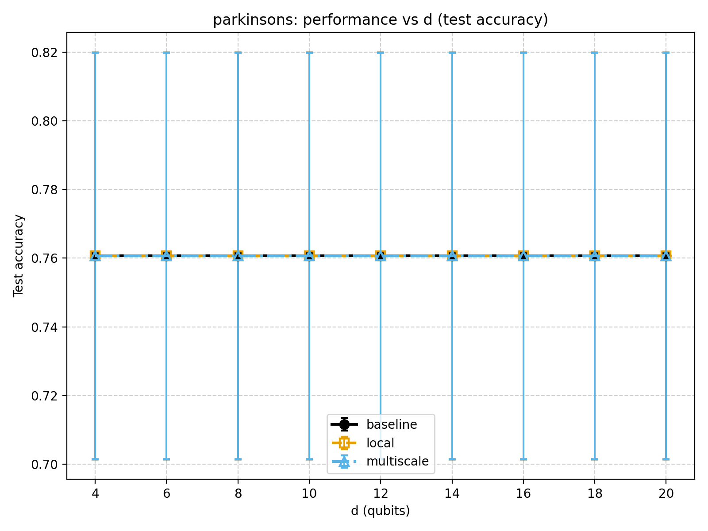

# Checkpoint 2
## Local and Multi-Scale Strategies to Mitigate Exponential Concentration in Quantum Kernels (#6)

----

## Project overview

Quantum kernels embed classical inputs into quantum states and use **state overlap** as a similarity score for kernel methods (e.g., SVMs). A key limitation is **exponential concentration**: as qubit count and/or circuit depth grows, kernel matrices drift toward the identity (off-diagonals near zero), reducing separability.

We implement and benchmark two mitigation strategies:

* **Local (patch-wise) kernels:** compute similarity on **subsystems** (patches) via reduced density matrices (RDMs), then aggregate across patches.
* **Multi-Scale kernels:** compute kernels at multiple granularities (local + global) and combine them via a **non-negative weighted mix**.

----

## Progress made 

We built a reproducible, end-to-end benchmarking pipeline:

* Baseline / local / multi-scale kernels under a shared API.
* TOML-driven runner (`scripts/run_experiment.py`) + multi-config orchestrator (`scripts/run_all_benchmarks.py`).
* Diagnostics + evaluation: off-diagonal histograms, eigen-spectra, and SVM with precomputed kernels.
* Stable run IDs and cross-platform path handling for reliable aggregation.

----

## Explorations and experiments

We validated the pipeline on toy datasets (`make_circles`, `iris`) and focused the main concentration study on real datasets:
`breast_cancer` and `parkinsons`, sweeping **dimension d (qubits/features)** while keeping comparisons matched (same feature map, depth, entanglement, backend, centered, normalization and split policy).

----

## Key insights and learnings

### Matched comparisons (uncentered, d=8 examples)

#### `breast_cancer (n=569, d=8)` : `zz_manual_canonical`, depth=1, ent=ring, centered=False

| Kernel     | Scales / Patches |    Weights | OffDiag μ±σ | EffRank | Align |   Val |  Test |
| ---------- | ---------------- |-----------:| ----------: | ------: | ----: | ----: | ----: |
| baseline   | all qubits       |          - | 0.012±0.030 |   475.8 | 0.073 | 0.781 | 0.675 |
| local      | 2q×4             |          - | 0.312±0.091 |    75.0 | 0.090 | 0.754 | 0.728 |
| multiscale | 2q×4 + 8q×1      | [0.5, 0.5] | 0.193±0.060 |   184.7 | 0.094 | 0.807 | 0.719 |

**Reading:** baseline shows the strongest concentration signature (off-diags ~0); local is best on **test** (0.728), multi-scale is competitive.

*Breast Cancer (8 qubits): local and multi-scale shift off-diagonals away from 0 and reshape the spectrum relative to baseline.*

---

#### `parkinsons (n=195, d=8)` : `zz_qiskit`, depth=1, ent=linear, centered=False

| Kernel     | Scales / Patches |    Weights | OffDiag μ±σ | EffRank | Align |   Val |  Test |
| ---------- | ---------------- | ---------: | ----------: | ------: | ----: | ----: | ----: |
| baseline   | all qubits       |          - | 0.004±0.008 |   193.6 | 0.072 | 0.769 | 0.795 |
| local      | 2q×4             |          - | 0.250±0.064 |    63.2 | 0.046 | 0.769 | 0.795 |
| multiscale | 2q×4 + 8q×1      | [0.5, 0.5] | 0.154±0.042 |   113.6 | 0.060 | 0.769 | 0.795 |

**Reading:** local reduces concentration strongly, but learning metrics do not improve in this sweep; this points to patch/feature-map/depth retuning.

*Parkinsons (8 qubits): local/multi-scale reduce concentration vs baseline, but no SVM gain here.*

----

### Scaling with dimension

To directly test that concentration happens when we increase the dimension, we ran **d = 4,6,8,10,12,14,16,18,20** for both `breast_cancer` and `parkinsons` (matched settings, uncentered kernels).

**What we observe (both datasets):**
* **Baseline concentrates rapidly with d**: off-diagonal median (**p50**) and tail (**p95**) drop toward ~0, consistent with "kernel -> identity".
* **Local and multi-scale mitigate concentration across all d**: p50/p95 stay far from 0, and the kernel spectrum stays structured.
* **Multi-scale is intentionally intermediate**: because it mixes global+local, it typically lands between baseline and pure-local in concentration metrics.

**Performance link (so far):**
* On **breast_cancer**, local/multi-scale remain competitive vs baseline across d (local often best).
* On **parkinsons**, concentration is reduced but **test accuracy is largely flat** across d, suggesting that "less concentration" alone is not sufficient without better patch design / feature-map / depth.

### Plots vs d 

**Breast cancer (d sweep):** include at least p50 + effective-rank (also p95 + test acc).

**Parkinsons (d sweep):** same structure:

----

### Technical challenges

* Cross-platform reproducibility: path/cwd issues fixed by resolving configs/outputs relative to repo root.
* Reliable aggregation at scale: stable run IDs + path normalization for robust joins.
* Numerical stability: consistent symmetrization, optional small diagonal regularization.

----

### Current status

* End-to-end pipeline runs baseline/local/multi-scale and produces diagnostics + summaries.
* **Main result so far:** baseline concentration worsens sharply as **d increases**, while local/multi-scale maintain non-trivial kernel structure across d; performance gains are dataset-dependent.

----

### Path forward

1. Improve patch design (overlapping / structured patches; try 1q/2q/3q mixes).
2. Weight selection: choose multi-scale weights via validation, then report test once.
3. Probe depth sensitivity (depth>1) once patch design is stable.
4. Add lightweight robustness checks (input noise / sampling noise).

**MVP target:** show at least one dataset where local or multi-scale yields a clear advantage (accuracy and/or robustness), supported by reduced concentration and improved kernel structure.